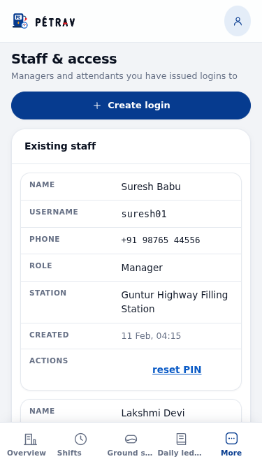
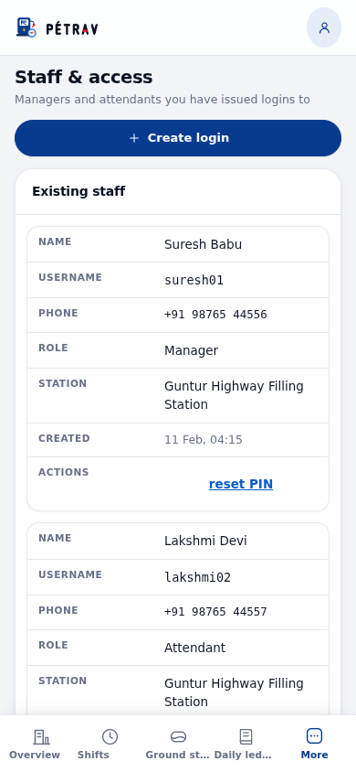

# Device test: service worker v6 → v7 upgrade

What a phone that already has PÉTRAV open or installed does when this change is
deployed, measured rather than assumed.

## What was run

Two real production builds were served from a host that behaves like GitHub
Pages (site under `/gas_station/`, unknown deep links answered with `404.html`,
hashed assets immutable, HTML revalidated, a missing hashed asset is a real
404):

| Build | Worker | Shell script                  |
| ----- | ------ | ----------------------------- |
| A     | v6     | `assets/index-DrzalcjT.js`    |
| B     | v7     | `assets/index-Dve_yxi7.js`    |
| C     | v8     | `assets/index-C0ypX37X.js`    |

Build A is `main` as it stands; build B is this branch; build C is a stand-in
for the _next_ deploy (one more stylesheet edit, one more version bump). Every
asset hash differs between them, which is the situation the change is about.

The client was Chromium 153 driven by Puppeteer, emulating an iPhone 12
(390 × 844, touch, mobile user agent) and an iPhone SE (375 × 667), with a
persistent profile so the service worker registration, the caches, and
`localStorage` all survived a reload exactly as they do on a handset. Supabase
was stubbed in the page so the Staff & access screen had data to render; the
worker never sees `*.supabase.co` traffic, so the stub cannot flatter it.

## Results

### The failure this change fixes (control)

Build A installed, then build B's assets published **with the old worker and no
version bump** — the mistake the new rule exists to prevent:

- Reload 1: still `index-DrzalcjT.js` (the previous deploy).
- Reload 2: still `index-DrzalcjT.js`.

The phone never leaves the old deploy. Only clearing site data breaks the loop,
which matches the symptom that prompted this work.

### This change (v6 → v7)

Build A installed, then build B published:

- Reload 1: still the old shell. The v6 worker is cache-first and is the one in
  control during that navigation, so it answers from its cache one last time.
  The v7 worker installs and activates underneath, purging `shell-v6` and
  `assets-v6`. The page still renders correctly — this is a stale render, not a
  broken one.
- Reload 2: `index-Dve_yxi7.js`, caches `shell-v7` + `assets-v7` only, and the
  Staff & access screen renders in full — header, subtitle, the "Create login"
  button, and all three staff rows.

**One reload is not enough for this particular upgrade, and no change to the
new worker can make it so:** the worker that handles that first navigation is
the old one, already on the phone. From v7 onwards it is a single reload.

### The next deploy (v7 → v8), on one reload

Build B installed, then build C published:

- Reload 1: `index-C0ypX37X.js`, header, "Create login" (40 px tall) and the
  staff table all present.

This is the behaviour the network-first navigation buys: the current deploy on
the first reload, every time.

### Offline

With the network disabled and no data cleared, a reload still boots the app
from the cached shell and shows the "Offline — showing the last data loaded"
bar. The cache fallback only runs when the fetch actually fails.

### "Create login" at the supported phone widths

Measured on the rendered page after the upgrade:

| Viewport      | Button size   | Position      | In viewport | Centre tappable |
| ------------- | ------------- | ------------- | ----------- | --------------- |
| 375 × 667     | 343 × 40 px   | x 16, y 131   | yes         | yes             |
| 390 × 844     | 358 × 40 px   | x 16, y 131   | yes         | yes             |

`document.elementFromPoint` at the centre of the button returns the button
itself at both widths, so nothing overlaps it. The 40 px height is the
`.tool-btn` minimum tap target.




## What this is not

This is a desktop Chromium emulating a phone: real viewport, real touch flags,
real service worker lifecycle, real HTTP cache — but not real iOS Safari, not a
real radio, and not a home-screen (standalone) launch. Two things are worth
confirming on an actual handset after the deploy lands:

1. **iOS Safari / an installed PWA.** Open the site (or the home-screen icon),
   pull to refresh **twice**, and confirm Staff & access shows the header, the
   "Create login" button and the staff table. The first refresh may still show
   the old build, for the reason above.
2. **A real flaky connection.** With poor signal rather than airplane mode, a
   navigation can hang instead of failing. This worker waits for the network to
   fail before using the cache; if that wait turns out to be noticeable on a
   forecourt, the next step is a timeout (fall back after ~3 s), which is a
   deliberate follow-up, not part of this change.

## Reproducing

The harness lives outside the repository (it needs two builds of different
commits and a browser download). The shape of it:

```
git archive <base> | tar -x -C /tmp/dt/base      # previous deploy
BASE_PATH=/gas_station/ npm run build            # in each tree, twice
node server.mjs /tmp/dt/serve 8080               # Pages-like static host
# install build A in a persistent browser profile, swap the directory to
# build B, reload without clearing storage, and assert on the DOM
```

The deterministic parts of the same behaviour are pinned in CI by
`src/lib/sw.cache.test.js` (the worker's fetch handling) and
`src/styles.screenHead.test.js` (the header rules at 375 px and 390 px).
